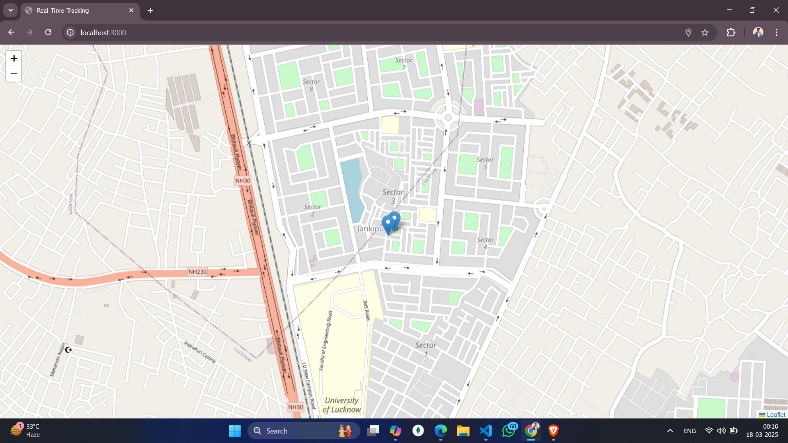

# Real-Time Location Tracking

This project demonstrates a real-time location tracking system using **Node.js**, **Express**, **Socket.IO**, and **Leaflet.js**. It allows clients to share their geolocation in real-time, which is displayed on a map interface.

---

## Features

- Real-time tracking of user location on a map.
- User-friendly map visualization using **Leaflet.js**.
- Tracks multiple users simultaneously.
- Handles user disconnections gracefully.

---

## Technologies Used

- **Frontend**:
  - HTML5, CSS3
  - Leaflet.js for map visualization
  - Socket.IO for real-time communication

- **Backend**:
  - Node.js
  - Express.js
  - Socket.IO

- **Dependencies**:
  - `express`: Web framework for Node.js
  - `http`: For creating the server
  - `socket.io`: Real-time bi-directional communication
  - `ejs`: Templating engine
  - `path`: To handle file paths

---
## Special Commands and Code Highlights

### 1. Serving Static Files
        app.use(express.static(__dirname + '/public'));
        // This command serves all static assets from the "public" directory.
### 2. Configuring the EJS View Engine
        app.set('view engine', 'ejs');
        // This sets up the Express app to use EJS for rendering dynamic HTML pages.
### 3. Socket.IO for Real-Time Communication
        io.on("connection", (socket) => {
            socket.on('sendLocation', (data) => {
                io.emit('receiveLocation', { id: socket.id, ...data });
            });
            socket.on("disconnect", () => {
                io.emit("userDisconnected", { id: socket.id });
            });
        });
        // Establishes event handling for receiving location data and managing user disconnections, broadcasting updates to all connected clients.
### 4. Leaflet.js Map Initialization
        const map = L.map("map").setView([0, 0], 16);
        L.tileLayer("https://{s}.tile.openstreetmap.org/{z}/{x}/{y}.png").addTo(map);
        // Initializes the interactive map and loads tile layers from OpenStreetMap.
### 5. Using the Geolocation API
        navigator.geolocation.watchPosition((position) => {
            const { latitude, longitude } = position.coords;
            socket.emit('sendLocation', { latitude, longitude });
        });
        // Continuously monitors the user's location and emits updated coordinates to the server for real-time tracking.
## How It Works
### Frontend:
    Renders an interactive map using Leaflet.js.
    Monitors user geolocation through the Geolocation API.
    Emits location updates to the server via Socket.IO.
    Updates markers on the map in real-time as new data is received.
### Backend:
    Listens for incoming socket connections and receives location data.
    Broadcasts updated geolocation information to all connected clients.
    Removes markers from the map when a user disconnects.

---
